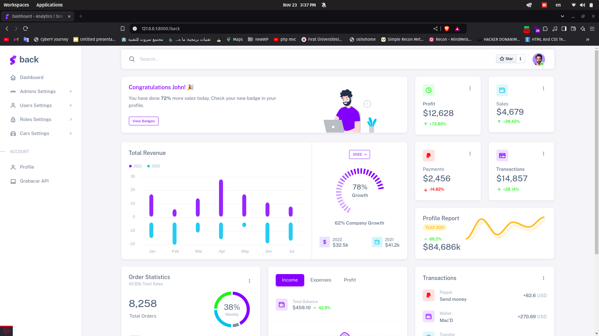
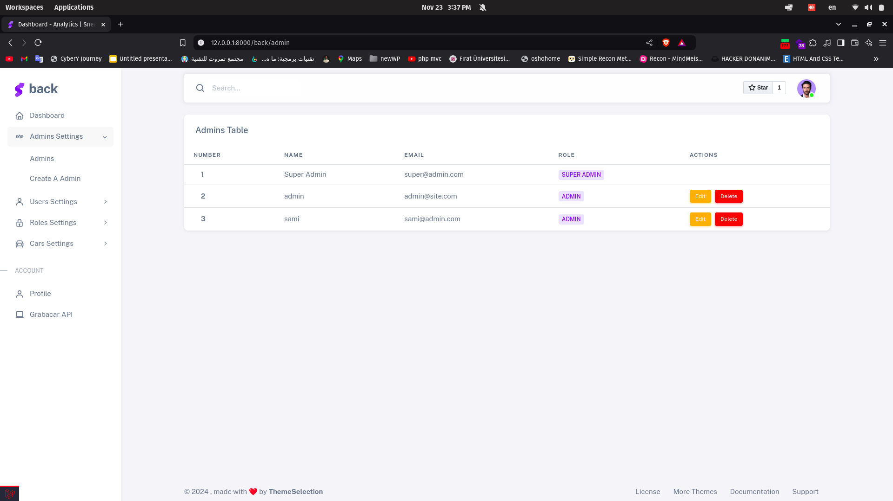
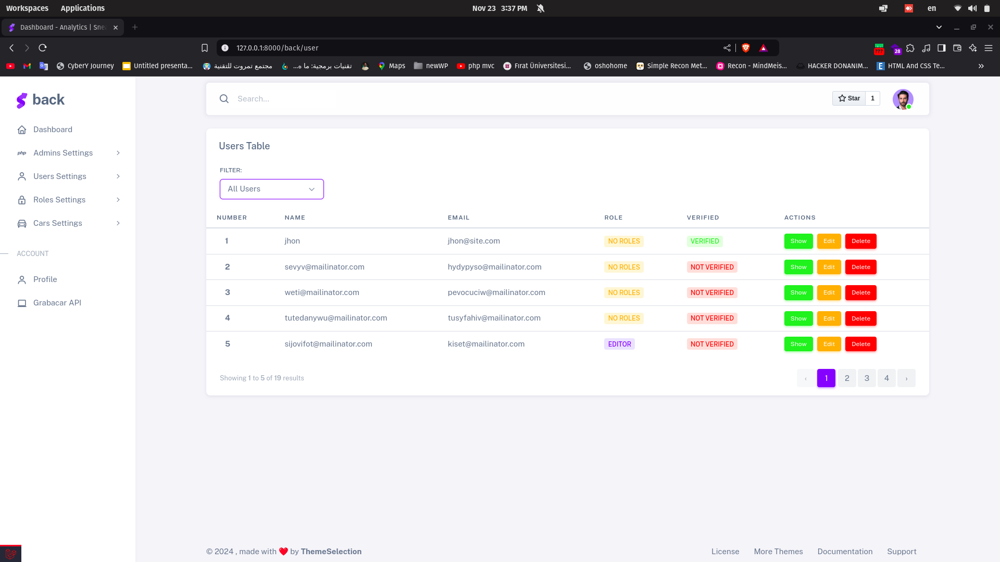
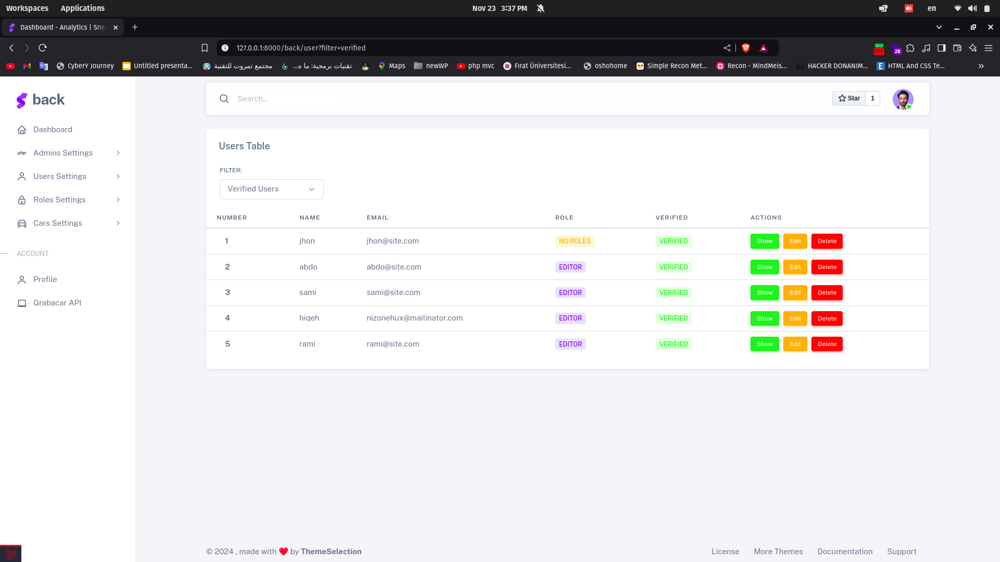
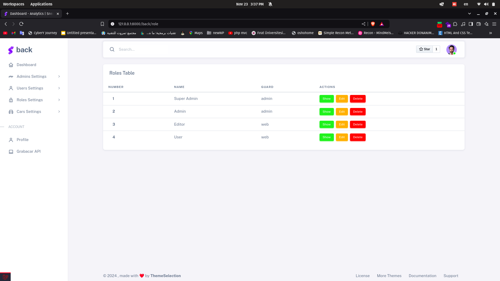
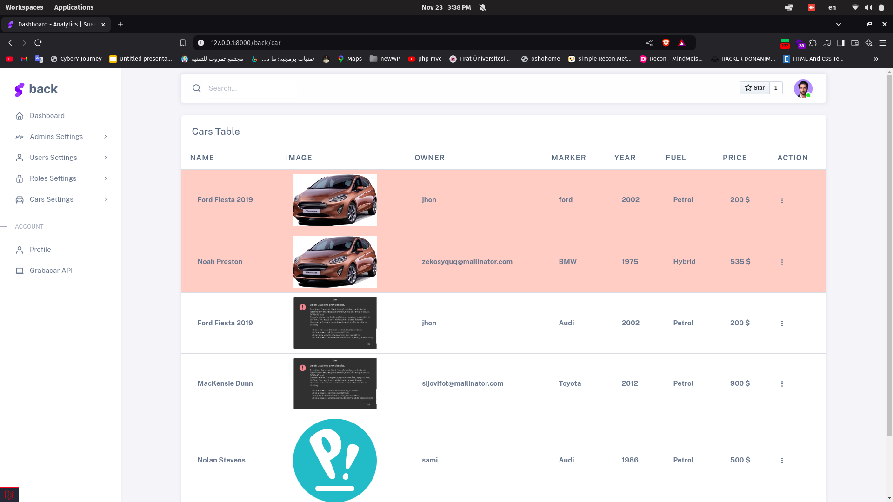
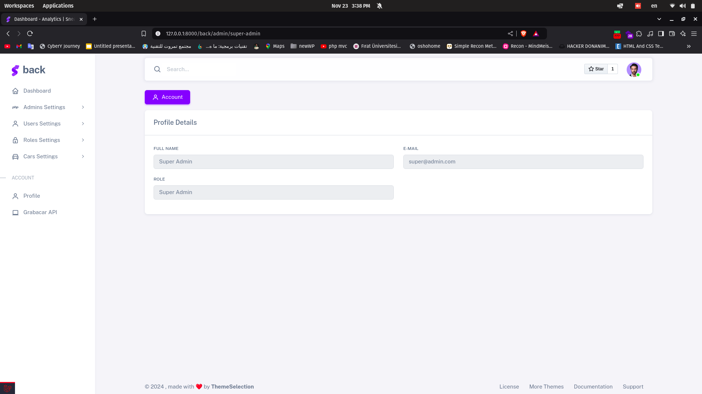
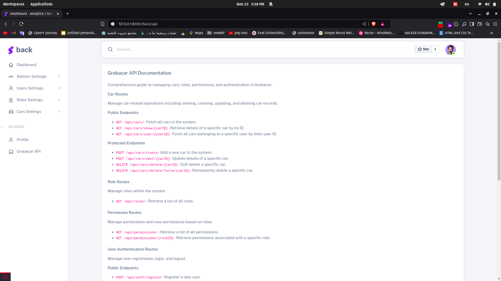

# Grabacar

A Laravel-based project to manage cars, users, roles, permissions, and authentication with a focus on performance and scalability.

## Features

1. **Cars Management**

    - View, create, update, and delete car records.
    - Soft delete and force delete options.
    - Integrated with Spatie Media Library for image handling.
    - Eager loading to solve N+1 problems in queries.

2. **Role-Based Access Control (RBAC)**

    - Manage roles and permissions using Spatie Laravel Permission.
    - Predefined roles:
        - **Super Admin**: Has full access to all resources and settings.
        - **Admin**: Manages users, cars, and general dashboard operations.
        - **Editor**: Limited access to specific features like editing car details.
    - Permissions are assigned dynamically based on roles.

3. **Authentication System with Guards**

    - Two separate dashboards for **admins** and **users**:
        - **Admin Dashboard**: Accessible via the `admin` guard. Designed for managing resources, roles, and permissions.
        - **User Dashboard**: Accessible via the `web` guard. Focused on user-specific features like favorite cars and profile management.
    - Guards ensure that users and admins are authenticated in their respective contexts.

4. **Favorite Car Feature**

    - Users can add cars to their "Favorites" list for quick access.
    - A custom helper function `checkIfUserAddedCarToFavorite()` determines if a car is already in the user's favorites.
    - API endpoints are available to manage favorite cars (add, remove, and list).

5. **Slug Management**

    - Auto-generate slugs for car names using Spatie Laravel Sluggable.

6. **Custom Helpers**

    - Utility functions to streamline common operations (e.g., checking permissions, user-specific operations).

7. **Logging**

    - Centralized logging using Laravel’s logging system.
    - Slack integration for real-time log monitoring.

8. **API Documentation**

    - Comprehensive API documentation for all endpoints.

9. **Optimized Development**
    - Debugging with Laravel Debugbar.
    - Query performance monitoring using Laravel Query Detector.

## Guard System

### Admin Dashboard (`admin` guard)

The **Admin Dashboard** is designed for managing system-wide resources:

-   Role and permission management.
-   Managing cars, users, and other core entities.
-   Accessible only by admins with roles like **Super Admin** and **Admin**.

### User Dashboard (`web` guard)

The **User Dashboard** is tailored for individual users:

-   View and manage their cars.
-   Add or remove cars from their "Favorites" list.
-   Restricted to features specific to user roles (e.g., **Editor**).

## API Documentation

### Car Routes

#### Public Endpoints

-   `GET /api/cars/`: Fetch all cars.
-   `GET /api/cars/show/{carID}`: Retrieve details of a specific car.
-   `GET /api/cars/user/{userID}`: Fetch cars owned by a specific user.

#### Protected Endpoints

-   `POST /api/cars/create`: Add a new car.
-   `POST /api/cars/edit/{carID}`: Update a car.
-   `DELETE /api/cars/delete/{carID}`: Soft delete a car.
-   `DELETE /api/cars/delete/force/{carID}`: Permanently delete a car.

### Favorite Car Routes

-   `GET /api/favorites/`: List all favorite cars for the authenticated user.
-   `POST /api/favorites/add/{carID}`: Add a car to the authenticated user’s favorites.
-   `DELETE /api/favorites/remove/{carID}`: Remove a car from the authenticated user’s favorites.

### Role Routes

-   `GET /api/roles/`: List all roles.

### Permission Routes

-   `GET /api/permissions/`: List all permissions.
-   `GET /api/permissions/{roleID}`: List permissions for a role.

### User Authentication Routes

#### Public Endpoints

-   `POST /api/auth/register`: Register a user.
-   `POST /api/auth/login`: User login.

#### Protected Endpoints

-   `POST /api/auth/logout`: User logout.

### Admin Authentication Routes

#### Public Endpoints

-   `POST /api/admin/auth/register`: Register an admin.
-   `POST /api/admin/auth/login`: Admin login.

#### Protected Endpoints

-   `POST /api/admin/auth/logout`: Admin logout.

### Authentication Middleware

All protected routes use the `auth:sanctum` middleware to ensure secure access.

## Dependencies

### Required

-   Laravel Framework 10.x
-   Laravel Sanctum
-   Spatie Media Library
-   Spatie Laravel Permission
-   Spatie Laravel Sluggable

### Development Tools

-   Laravel Debugbar
-   Laravel Query Detector
-   Laravel Breeze

## Installation

1. Clone the repository:

    ```bash
    git clone https://github.com/AbdulrahmanMaktabi/grabacar.git
    ```

2. Install dependencies:

    ```bash
    composer install
    npm install && npm run dev
    ```

3. Set up environment variables:

    ```bash
    cp .env.example .env
    ```

4. Run migrations and seeders:

    ```bash
    php artisan migrate --seed
    ```

5. Serve the application:
    ```bash
    php artisan serve
    ```

## Contribution

Pull requests are welcome. For significant changes, open an issue first to discuss your idea.

---

## Back Dashboard



## Back Dashboard - Admin Section



## Back Dashboard - Users Section




## Back Dashboard - Roles Section



## Back Dashboard - Cars Section



## Back Dashboard - Profile Section



## Back Dashboard - Api Section


